# python_base_image (基盤イメージ)

## 前提条件
- Dockerhubにアカウント作成済
- Githubにアカウント作成済
- Githubにpython_base_imageのリモートリポジトリ作成済

## 処理概要
- RPA処理でバージョン管理に細心の注意が必要なパッケージを基盤イメージに保存

## 環境構築
### ローカルリポジトリ上で基盤イメージ構築
```bash
## ディレクトリ作成
$ cd ~
$ mkdir python_base_image

## ローカルリポジトリ初期化
$ cd ~/python_base_image
$ git init

## ローカルリポジトリ初期設定 
$ git config --global user.email (自分のメールアドレス)
$ git config --global user.name Makoto-Araki

## リモートリポジトリ設定
$ cd ~/python_base_image
$ git branch -M main

## リモートリポジトリ設定
$ cd ~/python_base_image
$ git remote add origin git@github.com:Makoto-Araki/python_base_image.git

## 基盤イメージ用のDockerfile作成
$ cd ~/python_base_image
$ vi Dockerfile

## 基盤イメージ構築
$ cd ~/python_base_image
$ docker build --no-cache -t python_base_image:local .
```

### 基盤イメージ内を確認
```bash
## 基盤イメージから一時コンテナ起動、シェル接続で確認作業を行う
$ cd ~/python_base_image
$ docker run --rm -it python_base_image:local /bin/bash

## 一時コンテナ内で Google-Chrome 確認
$ cd ~
$ google-chrome --version

## 一時コンテナ内で Chrome Driver 確認
$ cd ~
$ chromedriver --version

## 一時コンテナ内で Selenium 確認
$ cd ~
$ pip list | grep selenium

## 一時コンテナから離脱
$ cd ~
$ exit
```

### リモートリポジトリにプッシュ
```bash
## ステージング移行
$ cd ~/python_base_image
$ git add .

## コミット
$ cd ~/python_base_image
$ git commit -m 20251231_01_コミット

## リモートリポジトリにプッシュ
$ cd ~/python_base_image
$ git push origin main
```

### Dockerhub 準備
#### Account Settings に遷移
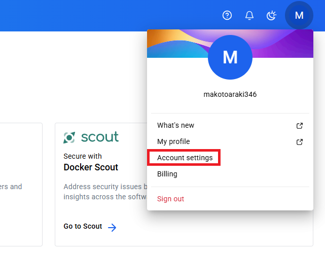

#### Personal Access Token (PTA) の画面に遷移
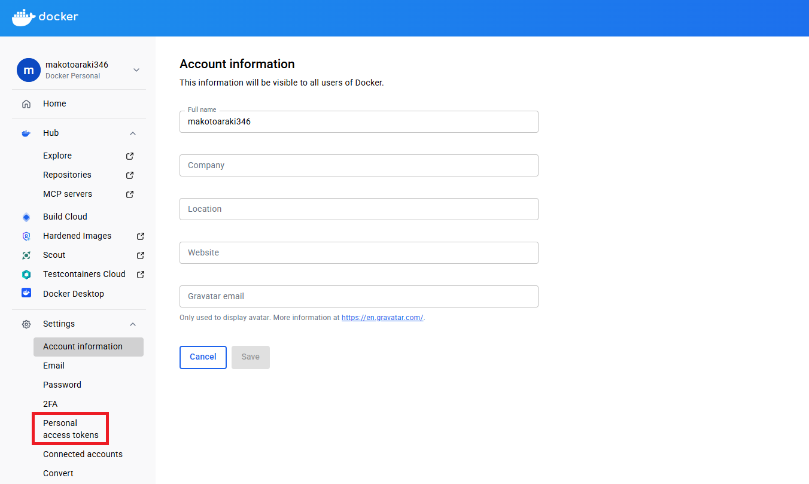

#### Generate New Token をクリック
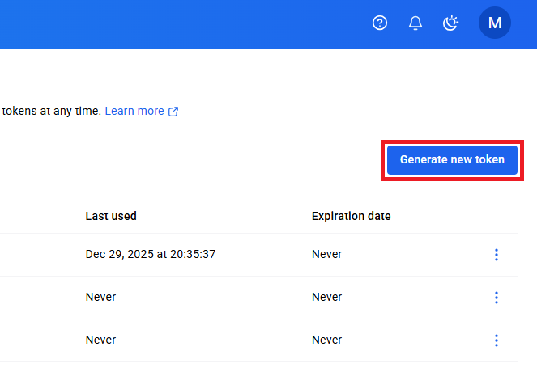

#### Personal Access Token (PTA) の情報を入力後に Generate で生成
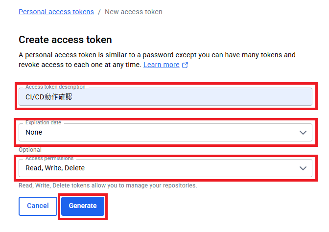

#### Personal Access Token (PTA) のアクセスコードが表示されるので Copy でクリップボード保存後に戻る
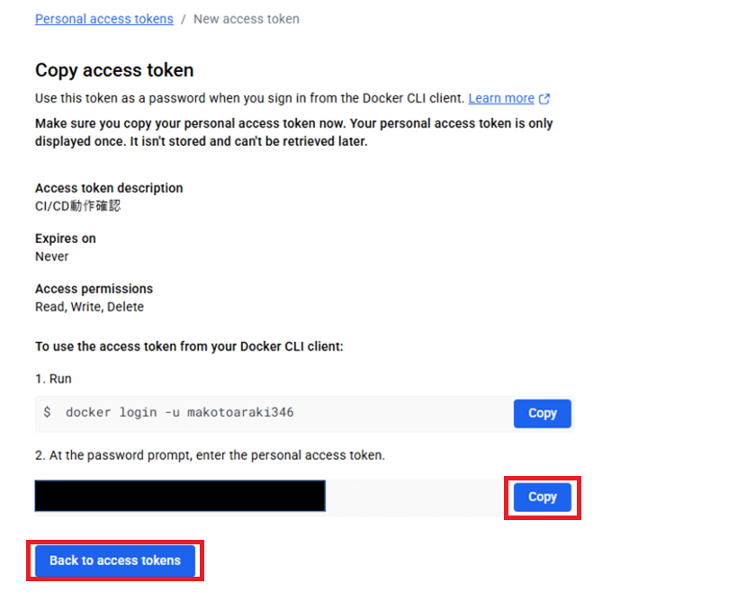

#### Personal Access Token (PTA) の生成を確認
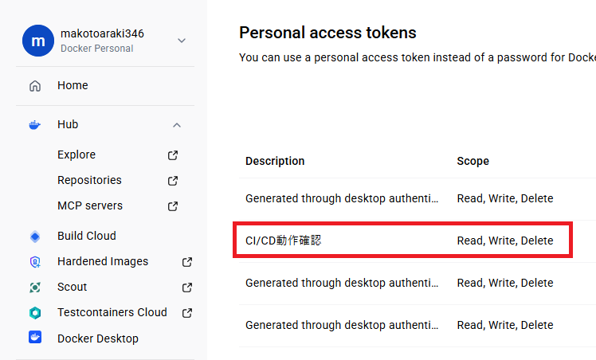

### Github 準備
#### Settings に遷移
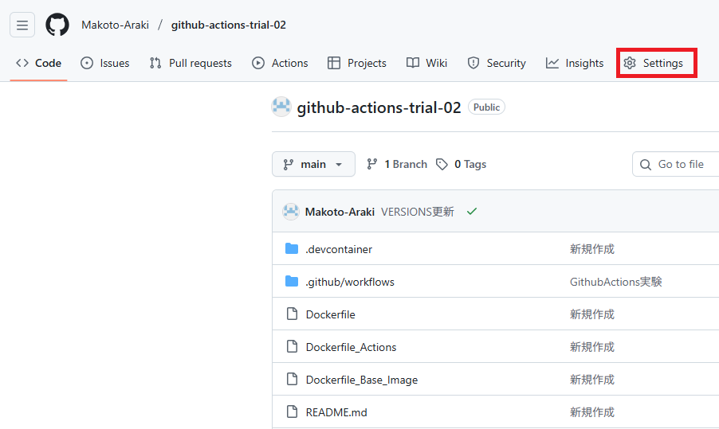

#### Secrets and Variables に遷移
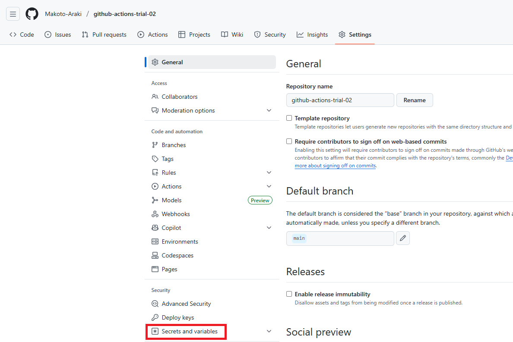

#### Actions を選択


#### New repository secret を押下
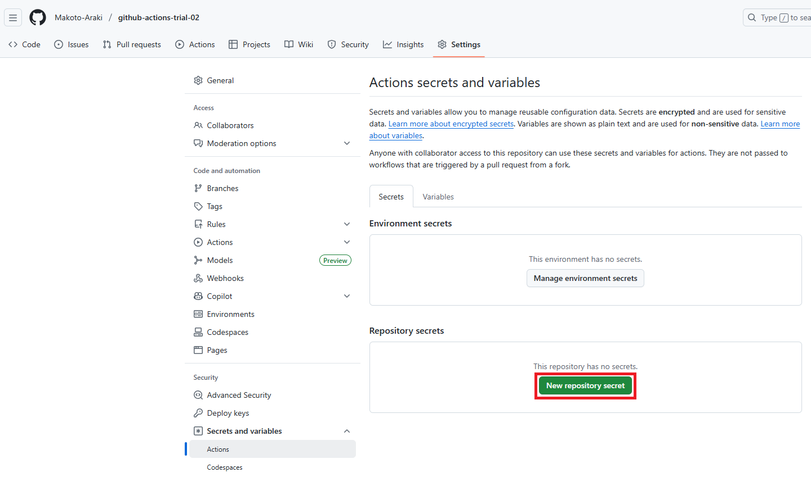

#### Github Actions 用の secret 入力画面が表示
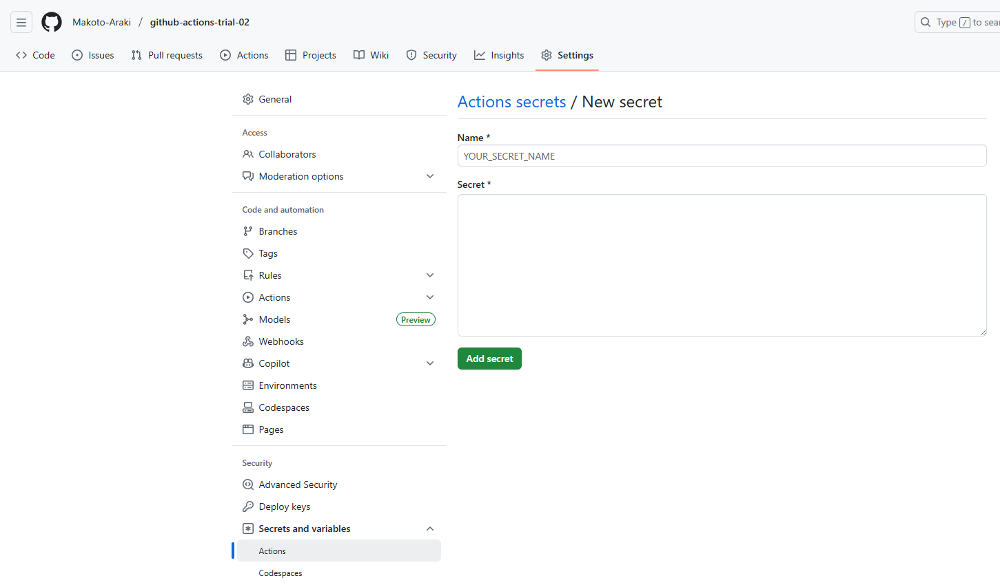

#### Github Actions 用の secret 入力１
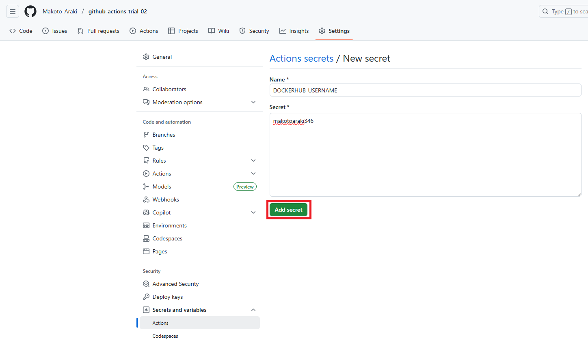

#### Github Actions 用の secret 入力２ ※クリップボード保存の Dockerhub PAT アクセスコードを入力
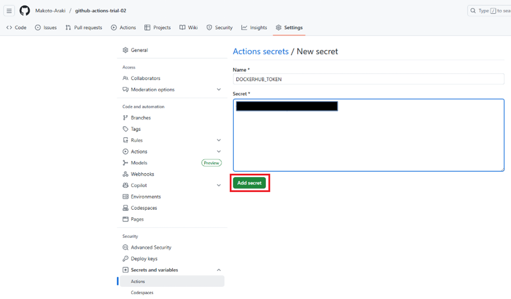

#### Repository Secret の登録確認
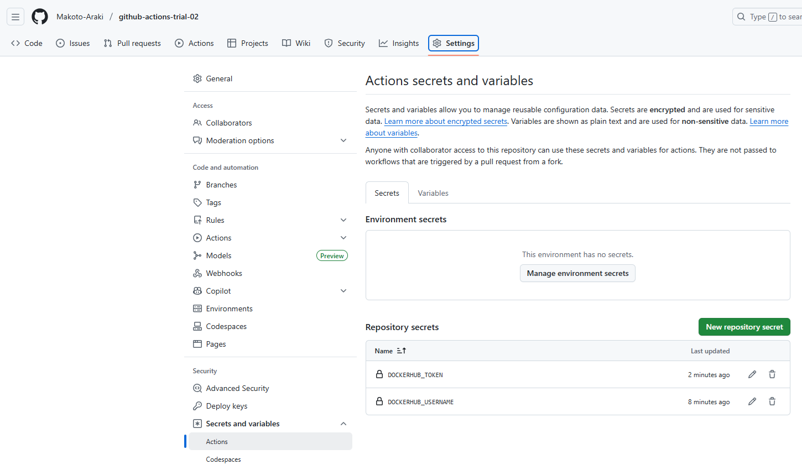

## Github Actions 用のYAML作成
```bash
## Github Actions 用のディレクトリ作成
$ cd ~/python_base_image
$ mkdir -p .github/workflows

## Github Actions 用のYAML作成
$ cd ~/python_base_image
$ vi .github/workflows/docker-build-push.yml
```

### Github Actions 動作開始
```bash
## ステージング移行
$ cd ~/python_base_image
$ git add .

## コミット
$ cd ~/python_base_image
$ git commit -m 20251231_02_コミット

## Github Actions 動作開始
$ cd ~/python_base_image
$ git push origin main
```

### Github Actions 動作確認
#### Github の Actions を押下
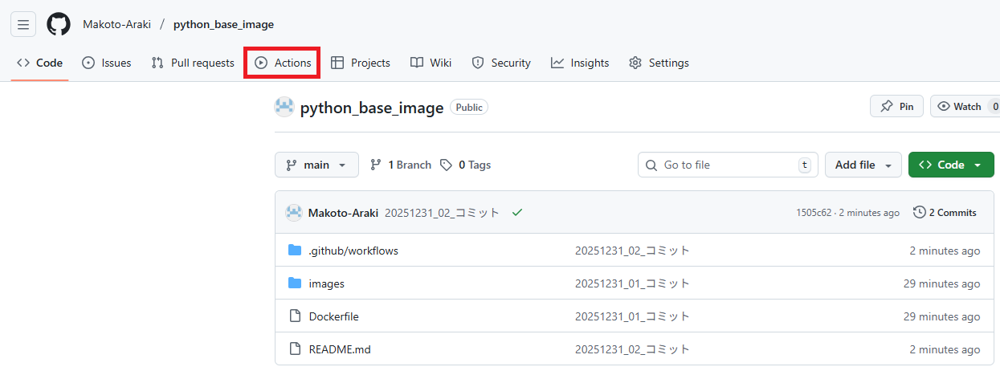

#### Github の Github Actions の結果確認
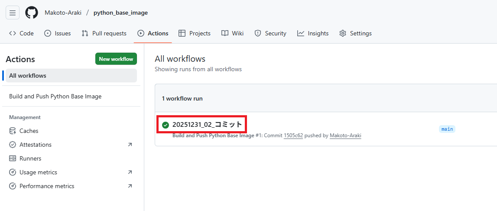

#### Dockerhub のバージョン確認
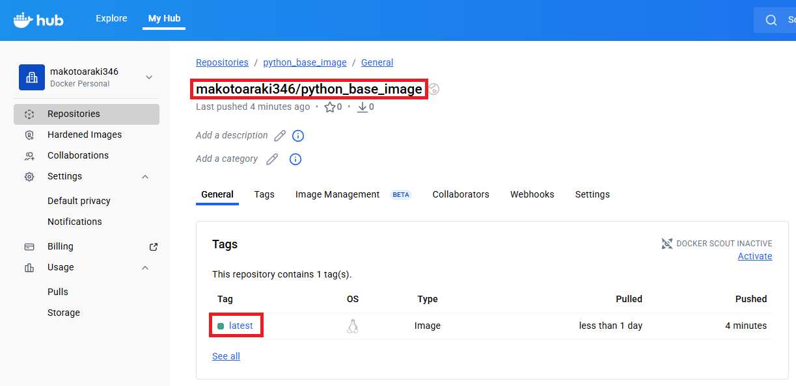
